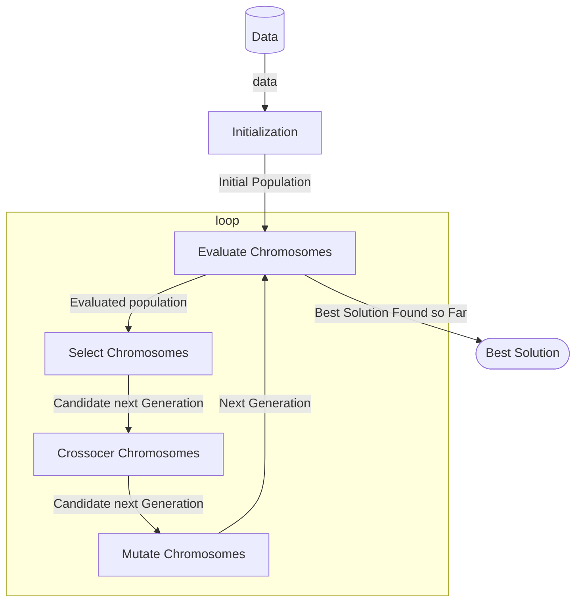

# Machine Learning

```yaml
title: Machine Learning
code: DLMDSML01
authors: n/a
date: 2024-04-10
publisher: IU Internationale Hochschule Gmbh
publisher_en: IU International University of Applied Sciences
version: 001-2024-0410
```

# 6. Genetic Algorithms

pp. 127-143

After completing this unit we should understand:
- The motivation behind genetic algorithms.
- The definition of a genetic algorithm.
- The different phases of genetic algorithms.
- The application of a genetic algorithm to solve the knapsack problem.
- The implementation of genetic algorithms in Python.

## Introduction

Earliest forms of life on earth existed over 3.5 billion years ago. Evolution has proven to find extraordinary solutions to existential challenges. Genetic evolution is the driving force behind variations across individuals of a population.

A **population**, in machine learning, is a group of objects in a particular space. 

Those that thrive in their environment will more likely reproduce, giving rise to the next generation. The environment changes constantly. This means evolution in nature is a continuous process with no defined end-state. 

Abstractly, we can view biological evolution as an optimization technique. 

The **Theory of Evolution** is a hallmark of biological change across time, Darwin's theory of evolution explains natural biological changes in and across species as adaptations to the species' habitat and environment. 

This theory of evolution has been used as a model for technical optimization procedures. However, in this adaptation the environment is considered static. Therefore, the process of evolutionary adaptation will continue until the fitness of individuals cannot be improved further. This stops the evolution process.

This means that an individual in the last generation is considered optimal and no individual can be better. 

An evolutionary algorithm initially generates a set of solutions to a problem in a random way. It tests each solution through a fitness function. The best solutions are evolved to the next generation in the evolution process. And the process continues until a near optimal solution is obtained and the output of the fitness function does not change. 

Evolutionary algorithms constitute a generic metaheuristic model for optimization problems that operates on a population-based representation of the solution space. 

A **population** in the evolutionary algorithm is a set of feasible solutions that may contain the best solution for a specific problem. The technique involves the transformation of a population from one generation to the next, where properties of individuals are represented by a code that can be modified to yield new exemplars. 

It uses and adapts the concept of biological DNA sequences, AKA **genes**, in which a child shares many of the characteristics of the two DNA sequences of their parents. 

A **gene** is a heredity unit that is transferred from a parent to their offspring that holds some characteristic of the offspring. 

Individuals that show a high amount of fit to the optimization objective are allowed to breed the next generations. 

This is a **heuristic** technique.
- The approach cannot guarantee global optimality of the resulting solution.
- The achieved solutions commonly prove to be sufficient for many practical purposes. 

If something is **heuristic**, then it is involving or enabling discovery or problem-solving through methods such as experimentation, evaluation, and trial-and-error. 

Note that Genetic Algorithms are but one subclass of evolutionary algorithms, which is part of the wider field of evolutionary computation and and biologically inspired algorithms and heuristics. 

Some other note-worthy approaches are:
- **Swarm Algorithms** - simulate the movement of a group of animals towards a specific target.
- **Ant Colony Algorithms** - simulate the communication between insects to find the shortest path between their nest and a food source. 
	- Ants deposit chemicals on the ground called pheromone when traveling from the nest to any food source. 
	- Ants move to where the chemical deposits are most frequent.
	- The indirect communication mechanism is called "stigmergy". 

Genetic algorithms are heuristic optimization methods. Most ML alrogithms can be formulated as optimization problems. A typical use case is feature selection. Genetic Algorithms are also commonly used in hyperparameter tuning!

A hyperparameter is a variable that influences a model's behaviour and output but is not adjusted by the training process. Examples are:
- The number of clusters in k-means;
- The limits on the depth of trees in decision tree leanring.

Genetic algorithms notably gained popularity in the optimization of structures and learning rules for artificial neural networks. 

We continue our discussion in more detail now. 

## 6.1 Genetic Algorithm Definition

p. 129;

**Genetic Algorithms** are a class of evolutionary algorithms that takes inspiration from biological genetic evolution of living organisms. The algorithm simulates the reproduction of individuals in a population in order to solve a specific optimization problem. This simulated evolution aims at iteratively exploring the space of possible solutions to find the optimum, or near-optimum, solution to the given problem. 

From the biological perspective, each individual in a population is composed of cells of different shapes and functionalities. 

Odd the book covers so many concepts and skips the cell. 

[Cell (Biology) | Wikipedia](https://en.wikipedia.org/wiki/Cell_(biology)); is the basic structural and functional unit of all forms of life, or organisms. Without going to far into the weeds, think of them as containers for the biological bits of life.

These constituent parts are encoded by a set of entities known as genes, or DNA. 

**Deoxyribonucleic Acid** (DNA) is a self-replicating material that is present in all living organisms, functioning as a carrier of genetic information. 

All the cells in an individual have the same DNA sequence that is different from that of other individuals. Genes are contained in chromosomes, which reside mainly in the cell nucleus. 

Every human cell contains 23 pairs of chromosomes, and each chromosome may contain hundreds to thousands of genes. 

Bringing it back to computer science, we can compare the DNA, and consequently the chromosome, as being encoded technically as a list of bits, the list being the chromosome and the bits being the genes. Consider and individual, $R$, that has the following chromosome `[1101000110]`, where the value (**genotype**) of the first gene in the chromosome is 1. 
- This function varies according to the domain problem.
	- The fittest individuals are selected for producing potentially even better offspring in the next generation.
	- The process is based on Darwin's theory of natural selection.
		- This posits that the opportunity for survival is large for highly *fitting* individuals, in accordance with the principle of the survival of the fittest. 
- The biological evolution process describes the genetic changes in a population through successive generations.
	- The genetic changes are the variations that occur in the reproduction process on the genetic level - thus, inherited by the next generations.
	- These changes occur in two important ways in genetic algorithms:
		- Crossover;
		- Mutations of the genetic structure. 

## 6.2 Genetic Algorithm Phases

p. 130;

The general process, or outline, of a genetic algorithm consist of 5 phases:
1. Creation of initial population.
2. Evaluation of the fitness function.
3. Selection of the fitness.
4. Crossover.
5. Mutation of the genetic structure.

At the end of these five phases, a new population is produced based on the current population. The Genetic algorithm goes through multiple iterations, where each iteration is formed by the above mentioned five phases. 

Iteration stops when (either): 
- An acceptable level of fitness is achieved by at least one individual.
- No further improvement in fitness can be achieved.
- A pre-defined maximum number of iterations has been reached. 

The iterating process in the genetic algorithm can thus be interpreted as a searching process that aims at finding successively better solutions. 



### 6.2.1 - Initialization Phase

Individuals of the population are generated randomly such that the corresponding chromosomes have a high coverage of the solution domain. The number of genes in individuals' chromosomes is dependent on the problem. 

### 6.2.2 - Evaluation Phase

A **Fitness Function** is used as an objective function that summarizes how well the designed solution is achieving a set of aims. Essentially, it measures how well a chromosome performs in an environment. 

Each individual's fitness is measured by a fitness function. The input of the function is the chromosome of the individual. The resulting output of this function is the fitness score of the individual. The fitness function operates according to the objective function of the problem. 

[Fitness Function | Wikipedia](https://en.wikipedia.org/wiki/Fitness_function) 
- This is a particular cost function that is used to summarize, as a single figure, how close a given candidate solution is to achieving the set aims. 
- Article is part of the "Evolutionary Algorithm" series. 

### 6.2.3 - Selection Phase

The individuals with the highest fitness scores are selected for generating the new population. 

Individuals with a fitness score that is higher than a specific threshold are selected, where the threshold constitutes a parameter that is defined according to the problem. 

This phase ensures that the newly generated population has better fitness than the current population. 

### 6.2.4 - Crossover Phase

The creation of a new offspring takes place in this phase through mixing the genes from the parent's pair of chromosomes. For the *crossover* to take place, some random point(s), the crossover point(s), have to be determined in the chromosomes of the parents. 

New term before we continue; a **Locus** is a specific location or point in the chromosome. 

Then, gene threads are cut and exchanged around this crossover point to create new threads. There exists two types of crossover methods:
- Single-point Crossover:
	- The procedure randomly chooses a *locus* and exchanges the sub-sequences before and after that locus between two chromosomes to create two offspring. 
	- This is like, different halves are swapped.
- Multi-Point Crossover:
	- Selects a set of points at random. Chromosomes are cut at the crossover points. Corresponding sections are swapped. 
	- This is like different chunks are swapped. 

### 6.2.5 - Mutation Phase

A **Mutation** happens when a gene undergoes a change in its structure caused by deletion, insertion, or rearrangement of the chemical code of which it is composed. 

In Computer Science, a mutation is the flipping of the random genes at arbitrary locations in the individual chromosome. This is done to prevent the population from falling into local optimum solutions too quickly. 

Mutation changes the new offspring by flipping its genes from 1 to 0, or from 0 to 1. Mutation can occur at each bit position in the string with some probability. 

### 6.2.6 - Genetic Algorithm Structure

The overall outline of the basic genetic algorithm can be described in the following steps:
- 1.) Initialization Phase.
	- The algorithm generates a random population of $n$ chromosomes.
	- This population represents the initial set of solutions.
	- Each chromosome in the population represents a possible solution for the domain problem. 
- 2.) Repeat the following steps until convergence:
	- 1.) Fitness.
		- Evaluate the fitness $f(S)$ of each chromosome $S$ in the current population. 
	- 2.) Selection.
		- Select the chromosomes having the highest fitness score from the population.
		- Each pair of selected chromosomes are mated together to create a new offspring.
	- 3.) Crossover.
		- Apply crossover between the parents to form a new offspring (child) that shares some of the characteristics of both parents. 
	- 4.) Mutation.
		- Mutate the new offspring at some positions in the chromosome.
	- 5.) Replace.
		- Replace the current generation by the new generation. 
- 3.) Return the final population.


## 6.3 Genetic Algorithm Example: Knapsack Problem

p. 133;

The "knapsack problem" is a famous problem in combinatorial optimization. 
- [Knapsack Problem | Wikipedia](https://en.wikipedia.org/wiki/Knapsack_problem)
- [Knapsack Problem | Geeks for Geeks](https://www.geeksforgeeks.org/dsa/introduction-to-knapsack-problem-its-types-and-how-to-solve-them/)

The problem can be stated as follows (per course text):
- Given a set of items, each item has a weight and a value. 
- Given a knapsack of maximum capacity, considered as the overall weight that the knapsack is limited to hold. 
- The problem is to select a subset of items so that:
	- The total value is as large as possible, and;
	- The total weight is less than or equal to the limit.

### 6.3.1 Knapsack Problem Mapping

We formulate the problem as follows:
- The problem is to select a subset of items from a set of $n$ items. 
	- Each item $x_j$ in $n$ items has a profit $p_j$ and weight $w_j$. 
	- The requirement for the selected subset of items is that:
		- the total profit of these items is maximized;
		- Under the constraint that the total weight of the items does not exceed the specific capacity $M$.
- Each subset of items $x_j$ represents a possible solution $S$ for the problem. 
	- i.e.; the target is to maximize the value of the fitness function $f(S)$.

$$
\tag{1}
f(S) = \sum_{j=1}^n{\left( p_jx_j \right)}
$$

This is subject to the constraint that the maximum allowed capacity is not exceeded. 

We let $f(S)$ function be the fitness function that evaluates the solution. The value $x_j$ is a binary value that indicates (1) if the item was selected and (0) if not. 

The solution (chromosome) $S$ is considered as a list of $n$ bits where location $j$ of each bit represents the item $x_j$. And example is suppose we have 8 items and items 1, 3, 5 are selected. The this particular solution looks like `S = [1,0,1,0,1,0,0,0]`.

In evolutionary algorithms, a set of solutions is tested in each generation during the evolution. Let the number of knapsack solutions in the evolutionary algorithm be $m$. 

The feasibility of each solution must be tested as follows:

Let the knapsack constraint be represented by $C$...

$$
C \to \sum_{j=1}^nw_jx_j \le M
$$

Infeasible solutions that break the constraint ARE allowed to exist during the evolution steps. However, a penalty is imposed to the fitness of the solution. The penalty is proportional to the total amount of excess in the knapsacks as follows:

$$
\tag{2}
Penalty = Q \cdot t \left( M - \sum_{j=1}^nw_jx_j \right)
$$

And we let the integer number $Q$ be a *sufficiently* large positive number - this way, these solutions won't be chosen as often to reproduce. 

And the function $t(z)$ works as follows:

$$
\begin{align}
t(z) &=
\begin{cases}
0 & \text{if} & z \ge 0 \\
-z & \text{if} & z \lt 0
\end{cases}
\end{align}
$$

The fitness function is now adjusted according to the penalty part:

$$
\tag{3}
f(S) = \sum_{j=1}^n{\left( p_j w_j \right)}
- \left( Q \cdot t \left( M - \sum_{j=1}^nw_jx_j \right) \right)
$$

### 6.3.2 Solving the Knapsack Problem

The course book now gives a concrete example of a bag with max carry capacity of $M = 22$. It gives more details, you must resort to the book for the example for now. 

1. Initialization - generation a number of random solutions. 
2. Fitness - calculate based on fitness function.
3. Selection - 
4. Crossover
5. Mutation
6. Replace
7. Repeat steps 2-6 until an optimal solution is found. 

## 6.4 Genetic Algorithm in Python

p. 137;

This section implements the genetic algorithm for solving the knapsack problem in Python. 

### 6.4.1 Main Steps

The `main` function runs all the steps of the genetic algorithm. It calls two important functions: `initialization` and `evolution`. The steps to the main function are:
- Set known values such as knapsack maximum capacity, etc...
- Get your list of items - this problem generates a random list. 
- Initialization = the initial population is created (subsets of items to solve problem).
- The function processes a series of steps in a loop:
	- Fitness = calculate fitness of each solution. 
	- Selection, Crossover, Mutation = parts of the `Evolution` function.
	- Replace = evolution returns a new generation of the population. 
		- Note - the total fitness of the population is counted and printed for each generation. According to the steps, the total fitness *should* be increasing gradually.
- This function ends with the child population when the loop hits the `GEN_MAX`, set to 50. 

The book provides real code. The very interesting function is `Evolution` and how it handles Crossover and Mutation. 

## Summary

p. 141;

We mentioned Swarm and Ant Colony algoritms, but did not venture into their details. We dove into Genetic algorithms, based on bio-inspired concepts of:
- Survival of the fittest, and;
- Genetic evolutionary variation (e.g. crossover and mutation).

The main phases of genetic algorithms are:
- Initialization;
- Evaluation;
- Selection;
- Crossover;
- Mutation;
- Replacement.

The knapsack problem is a popular application example of genetic algorithms. We thoroughly discussed how the problem can be solved by modeling the candidate solutions of the problem as chromosomes and by setting a suitable fitness function to evaluate the solution candidates. 

## Beyond

> from me.

[Evolutionary Algorithm | Wikipedia](https://en.wikipedia.org/wiki/Evolutionary_algorithm) is a series that I think would be worth revisiting one day. 

We never dove into the [Ant Colony Optimization Algorithms | Wikipedia](https://en.wikipedia.org/wiki/Ant_colony_optimization_algorithms) that requires many little agents working together.
