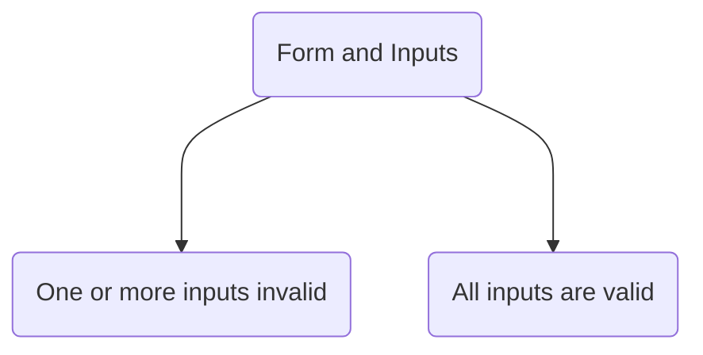

# React - Complete Guide

So, other notes are in MS word. Hoping to eventually migrate notes over to markdown. 

- [ ] Finish Udemy Course
- [ ] Migrate Notes

## Section 15: Building Custom React Hooks

### Lesson 185: Module Introduction

So far, we have been working with the built-in React hooks. Just to recap the rules of React Hooks:
- Only call React Hooks in React Functions.
	- React component functions
	- **In Custom Hooks**
- Only call hooks at the top level.
	- Do not call in nested functions.
	- Do not call them in block statements. 

An an _unofficial_ rule for `useEffect()` is to **always** add everything you refer to inside the hook as a dependency. 

Things to discuss:
- What are custom hooks?
- Why do we need them?
- How do we build and use them?
- What are custom hook rules and best practices?

### Lesson 186: What are "Custom Hooks"?

Custom hooks are regular functions just like the built-in React hooks. However, they are functions that can contain **stateful** logic. Unlike "regular functions", custom hooks can use other React hooks and React state. They are bits of re-usable logic that can benefit from React's built-in hooks. 

### Lesson 187: Creating a Custom React Hook Function

There's an example project with this lesson. There are two main components that count up and down each second respectively. Because the components are so similar, it is safe to say there is code duplication. 

Typically when we have code duplication, we want to abstract it into a function (or something similar) to improve readability and scalability. However, our components require using React hooks, like `useEffect()` and depend on state. Since we cannot use hooks in ordinary functions, we need to outsource them to custom hooks. 

To get started, let's create a custom hooks directory and file, `/src/hooks/use-counter.js`. You can name the file what you want, but the rule about hooks is they **must** begin with the word "use". This signals to React that our function is a custom hook, and allows the React to monitor its use. So, if we violate any rule of hooks, we should get warning ahead of time. 

For our example, we are going to copy the logic out of one of the similar components. 

```js
import  React, {useState, useEffect} from  'react';

const  useCounter = () => {
	const [counter, setCounter] = useState(0);
	
	useEffect(() => {
		const  interval = setInterval(() => {
			setCounter((prevState) =>  prevState + 1);
		}, 1000);
		return () =>  clearInterval(interval);
	}, []);

	return counter;
};

export  default  useCounter
```

Note, we will also return the `counter`. The hook is like a regular function, or you can think of it like `useState()`. The component we will use this in will require this value, so we must return it. 

This is only what we have so far. 

### Lesson 188: Using Custom Hooks

We must import them like we would a regular hook, just from their relative location instead of from 'react'. In our example, we will import the hook into our `<ForwardCounter/>` component. 

First, let's just look at what we would have had to do without a custom hook:

```js
import React, { useState, useEffect } from  'react';
import  Card  from  './Card';
import  useCounter  from  '../hooks/use-counter';

const  ForwardCounter = () => {
	const [counter, setCounter] = useState(0);

	useEffect(() => {
		const  interval = setInterval(() => {
		setCounter((prevCounter) =>  prevCounter + 1);
	}, 1000);
	
	return () =>  clearInterval(interval);
	}, []);
	
	return  <Card>{counter}</Card>;
};

export  default  ForwardCounter;
```

It's basically the `useCounter()` hook logic, just unpacked in the component. Now, let's use our custom hook:

```js
import  React  from  'react';
import  Card  from  './Card';
import  useCounter  from  '../hooks/use-counter';

const  ForwardCounter = () => {
	const  counter = useCounter();
	
	return  <Card>{counter}</Card>;
};

export  default  ForwardCounter;
```

As seen above, you can call the hook in our component like a regular built-in React hook. Important to remember that if your custom hook has state or effects within it, then those will be tied to the component(s) you call the hook in.  Suppose just to be clear, if you call the hook in multiple components, they will __not__ share the same state. Each one gets its own state in reference to the hook. 

It keeps the components a bit smaller, more slim.

### Lesson 189: Configuring Custom Hooks

We are now going to look at our `<BackwardCounter />` component. It is similar logic, but our component counts down instead of up. We don't want to create a separate custom hook with very similar logic, but rather make the current hook configurable by accepting arguments. Consider the built-in `useState()` hook, which can take in an initial state. 

We _could_ go as far as to allow a user to pass in an entire function to determine how the counter is updated each second. But, we will settle for just a flag as our custom hook doesn't need to be that flexible. Our flag will run through a conditional statement to determine how state is changed. 

```js
import React, {useState, useEffect} from 'react';

const useCounter = (countForwards = true) => {
    const [counter, setCounter] = useState(0);

    useEffect(() => {
        const interval = setInterval(() => {
            if (countForwards) {
                setCounter((prevState) => prevState + 1);
            } else {
                setCounter((prevState) => prevState - 1);
            }
        }, 1000);

        return () => clearInterval(interval);
    }, [countForwards]);

    return counter;
};

export default useCounter
```

Notice that our `useEffect()` gained an external dependency. For now, we don't expect the dependency to change, but it's still good practice to list dependencies. 

And here is the `<BackwardCounter />` component:

```js
import React from 'react';
import useCounter from '../hooks/use-counter';

import Card from './Card';

const BackwardCounter = () => {
  const counter = useCounter(false);

  return <Card>{counter}</Card>;
};

export default BackwardCounter;
```

### Lesson 190: Onwards To A More Realistic Example

This lesson begins with a new example project. It requires a backend, so you can add your own firebase links. Using the _Realtime Database_ service, we would set the following rules:

```json
{
	"rules": {
		".read": true,
		".write": true
	}
}
```

You want to use your own URL, but add on the `...firebaseio.com/tasks.json` so that the information is saved in a `tasks.json` file. 

This is just a task application. The `<App />` component fetches information from the backend and runs it through others to display the information. We store data by sending a POST request. 

Currently, each component handles its own http requests. But this is a good opportunity to create a configurable custom hook. Even though there are differences with sending GET and POST requests, there are many similarities. For example, they both handle loading and error handling states, things _Axios_ may do for you. Since we have duplicate logic, we want to abstract some of it away in a function. But because the logic requires hooks like `useEffect()` and `useState()`, we can't use a regular function, it must be a custom hook. 

### Lesson 191: Building a Custom HTTP Hook

A good start is to add a `/app/src/hooks/` directory, same level as the "components" directory. It's common convention. We then create a file, `/app/src/hooks/use-http.js`. The function we create will be "useHttp", and must begin with the word "use". The component needs state for loading and errors. 

We want to design the hook to be quite generic, not just specific to fetching tasks. We want to fetch any kind of data from any kind of URL, and make any kind of transformations. That will require parameters. Below is a pretty good approach. 

```js
import React, { useState, useEffect } from 'react';

const useHttp = (requestConfig, applyData) => {
    /** Params:
     *      requestConfig - object to configure fetch API
     *          url - URL to send request to
     *          method - GET or POST
     *          headers - 
     *          body - JS object
     */
    const [isLoading, setIsLoading] = useState(false);
    const [error, setError] = useState(null);

    const sendRequest = async (taskText) => {
        setIsLoading(true);
        setError(null);
        try {
            const response = await fetch(
                requestConfig.url, {
                    method: requestConfig.method,
                    headers: requestConfig.headers,
                    body: JSON.stringify(requestConfig.body)
                }
            );

            if (!response.ok) {
                throw new Error('Request failed!');
            }

            const data = await response.json();
            applyData(data);

        } catch (err) {
            setError(err.message || 'Something went wrong!');
        }
        setIsLoading(false);
    };

    return {
        isLoading,
        error,
        sendRequest
    }
}

export default useHttp;
```

We handle all of the arguments of the fetch API with a `requestConfig` object. We also handle errors and receiving JSON data. Although we want the hook to be flexible, accepting other data types is beyond the scope of this course. We also take in a function to transform the data. This allows the component that is using the hook to configure the output to its specifications. 

Now, we have many values that the component using the hook will need access to. That is why we are returning the object of values. 

### Lesson 192: Using the Custom Http Hook

In the `<App/>` component, we can import our hook and remove logic that it replaces. We also need to pass in the required arguments. For the GET request, we don't need any header or a body, and the default method is GET for the `fetch()` API. 

However, in the spirit of type checking, we can implement some data checks in the `use-http.js` file:
```js
try {
    const response = await fetch(
        requestConfig.url, {
			method: requestConfig.method ? requestConfig.method : 'GET',
			headers: requestConfig.headers ? requestConfig.headers : {},
			body: requestConfig.body ? JSON.stringify(requestConfig.body) : null
        }
    );
```

That just allows for the object to be flexible itself. 

We also need to add a function, which the logic can be found in the component. Remember that the custom hook also returns values. 

```js
import React, { useEffect, useState } from 'react';

import Tasks from './components/Tasks/Tasks';
import NewTask from './components/NewTask/NewTask';
import useHttp from './hooks/use-http';

function App() {
  const [tasks, setTasks] = useState([]);
  requestConfig = {
    url: 'https://react-http-6b4a6.firebaseio.com/tasks.json',
  }

  const transformTasks = (taskObj) => {
    const loadedTasks = [];

    for (const taskKey in taskObj) {
      loadedTasks.push({ id: taskKey, text: taskObj[taskKey].text });
    }

    setTasks(loadedTasks);
  }

  const httpData = useHttp(requestConfig, transformTasks);
  const { isLoading, error, sendRequest: fetchTasks } = httpData;

  useEffect(() => {
    fetchTasks();
  }, []);

  const taskAddHandler = (task) => {
    setTasks((prevTasks) => prevTasks.concat(task));
  };

  return (
    <React.Fragment>
      <NewTask onAddTask={taskAddHandler} />
      <Tasks
        items={tasks}
        loading={isLoading}
        error={error}
        onFetch={fetchTasks}
      />
    </React.Fragment>
  );
}

export default App;
```

This isn't complete because we aren't using the `useEffect()` hook in the best practices kind of way. 

### Lesson 193: Adjusting Custom Hook Logic

We want our code to follow best practices, but if we put the `fetchTasks()` function as a dependency in the `useEffect()` hook, it will cause an infinite loop. Basically, the state in the custom hook changes and causes the component to re-render. That calls the custom hook again, which re-creates the `sendRequest()` function... 

To fix this, we can wrap the function in our custom hook in the `useCallback()` hook. 

```js
import React, { useState, useCallback } from 'react';

const useHttp = (requestConfig, applyData) => {
    ...
    const sendRequest = useCallback(async (taskText) => {
...
```

Recall that the `useCallback()` hook also takes in a dependency array. However, both `[requestConfig, applyData]` are objects passed in through the `<App/>` components, so we must ensure they are not excessively recreated. 

That means we wrap our `transformTasks()` function in `useCallback()`, which uses state as an external dependency, but React guarantees that to remain constant. 

Let's think about how to prevent the `requestConfig` object from re-rendering. We could use the `useMemo()` hook, or we can rework our `useHttp()` hook. 

```js
...
  const requestConfig = useMemo(() => {
    return ({
      url: 'https://react-http-6b4a6.firebaseio.com/tasks.json'
      }
    )
  }, []);
...
```

The second way is to actually have all the arguments passed into the `sendRequest()` function that is returned from the hook. Then, we can create and pass both of those values into the function inside of the `useEffect()` hook, which will eliminate the re-rendering. This method minimizes dependencies, but the logic can be more complicated. 

This leads to an interesting lesson, the sooner you introduce objects into your code, the longer you have to manage them. So, to reduce complexity we can introduce objects and information only when required. 

### Lesson 194: Using the Custom Hook in More Components

We also want to create new tasks with a component using our custom hook. This is in `/app/src/components/NewTaks/NewTask.js`. We start by importing our custom hook, and then calling it in the component. We also store its outputs in variables. 

The function `enterTaskHandler()` is called when the user submits a form. We want to run our `sendRequest()` function, returned by our custom hook, when the form is submitted. Since we are sending a POST request, we have to fill in some additional information. 

There is an interesting problem that arises. We want to pass in the text that we get from the form into the hook's generated function. But it only accepts json data returned by the request, which in a POST request case could just be 'OK'. 

We can use the `.bind()` method to bind the value to our function/object. The `bind()` method works on all objects. The first parameter is the object to define as `this`. The other parameters will be what is also passed into the function. Remember, this is a pre-configuration, so the data passed in naturally gets passed in after the `bind()` method passes in information. 

More information about `bind` can be found in this [Academind article](https://academind.com/tutorials/function-bind-event-execution). 

```js
import React from 'react';

import Section from '../UI/Section';
import TaskForm from './TaskForm';
import useHttp from '../../hooks/use-http';

const NewTask = (props) => {
  const httpData = useHttp();
  const { isLoading, error, sendRequest: sendTaskRequest } = httpData;

  const createdTask = (taskText, taskData) => {
    const generatedId = taskData.name; // firebase-specific => "name" contains generated id
    const createdTask = { id: generatedId, text: taskText };

    props.onAddTask(createdTask);
  }

  const enterTaskHandler = async (taskText) => {

    sendTaskRequest({
      url: 'https://react-http-6b4a6.firebaseio.com/tasks.json',
      method: 'POST',
      headers: {
        'Content-Type': 'application/json',
      },
      body: { text: taskText }
    }, createdTask.bind(null, taskText));
  };

  return (
    <Section>
      <TaskForm onEnterTask={enterTaskHandler} loading={isLoading} />
      {error && <p>{error}</p>}
    </Section>
  );
};

export default NewTask;
```

## Section 16: Working w/Forms and User Input

### Lesson 196: Module Introduction

Let's talk about forms and handling user input. It might sound trivial, but many web applications are all about forms and capturing user input. It may also be more difficult to provide useful feedback to the user while they fill out forms, for incorrect values and such. 

We won't touch on new React features, but cover the following:
- What is complex about forms?
- How to handle inputs and Forms with React.
- Tools and approaches to simplify the process.

### Lesson 197: Our Starting Setup

The starter project is just a simple form that takes in a name. We will not talk about HTML and CSS, those are provided and assumed. 

### Lesson 198: What is so complex about forms?

Forms can be complex because they, and their inputs, can assume different states. Examples are...



States may also be unknown if the checking is asyncronous. Suppose you need to send information to a server, like an email, to determine if it is valid, or already exists. 

However, we can think of the sum of the states within the form make up the form's state. When there are errors, we as developers want to output **input-specific** error messages and highlight problematic inputs. We also must ensure the form cannot be submitted or saved if it has errors. 

Things get more complex when we try to dive into displaying error messages. The question becomes when to validate user input? 
- When the form is submitted?
- When the input loses focus?
- On every keystroke?

Each has its pros and cons. If we check the form as a whole, we allow the user to enter invalid values before warning them. It's good because we aren't jumping the gun, giving warning before they are even done typing. It avoids unnecessary warnings but may present feedback "too late". That may not be the greatest user experience. 

When we validate after an input loses focus, we allow the user to finish typing their input before validation, again not jumping the gun. And we provide feedback in a timely manner, when they are done providing information. Very useful approach for _untouched_ forms. The downside is that if the user has made a mistake, we cannot tell them whether their new input is correct until after they finish typing again. 

That is where validation on keystroke can be handy. You provide feedback to a user on every keystroke, checking if the input is valid. The biggest downside to warning a user before they have had a chance to finish typing. So, you might see a lot of errors, which is not a great UX. However, if this approach is only applied on invalid inputs, it has the potential of providing direct feedback. 

### Lesson 199: Dealing with form submissions and getting user input

We currently have a `<SimpleInput/>` input component. 

```js
const SimpleInput = (props) => {
  return (
    <form>
      <div className='form-control'>
        <label htmlFor='name'>Your Name</label>
        <input type='text' id='name' />
      </div>
      <div className="form-actions">
        <button>Submit</button>
      </div>
    </form>
  );
};

export default SimpleInput;
```

It currently has no state to validate input. We can capture input with a `ref` to check input when the user is done typing, or useState to view input on every keystroke. We will start with catching every keystroke. 

Import `useState` and create the state. We then have to add an event listener to the `<input/>` element that changes state. The event listener, per vanilla JavaScript, will receive an `event` object by default that holds the values we need. We will actually bind the event listener to the `onChange` event listener, as it is better than key-down or key-up. 

We also need an event listener for the form submission so we prevent the page from re-rendering. We call `event.preventDefault();` on the event listener, and bind it to the `onSubmit` event listener of the `<form/>` element. We will also just log the name to the console just to show the updates so far. 

Updates:
```js
import React, { useRef, useState } from 'react';

const SimpleInput = (props) => {
  const [enteredName, setEnteredName] = useState('');

  const nameInputChangeHandler = event => {
    setEnteredName(event.target.value);
  }

  const formSubmissionHandler = event => {
    event.preventDefault();

    console.log(enteredName);
  }

  return (
    <form onSubmit={formSubmissionHandler}>
      <div className='form-control'>
        <label htmlFor='name'>Your Name</label>
        <input type='text' id='name' onChange={nameInputChangeHandler}/>
      </div>
      <div className="form-actions">
        <button>Submit</button>
      </div>
    </form>
  );
};

export default SimpleInput;
```

What about the `useRef` approach? Create a `ref` with the hook and set the ref inside the `<input />` element. We can then read the value from the `refObject.current.value;` property. 

```js
import React, { useRef, useState } from 'react';

const SimpleInput = (props) => {
  const nameInputRef = useRef();

  const formSubmissionHandler = event => {
    const enteredValue = nameInputRef.current.value;
    console.log(enteredValue);
  }

  return (
    <form onSubmit={formSubmissionHandler}>
      <div className='form-control'>
        <label htmlFor='name'>Your Name</label>
        <input ref={nameInputRef} type='text' id='name' />
      </div>
...
```

So, here we are just looking at the `ref` when the form is submitted. 

Don't forget that we can also set the value of the `<input ... value={enteredName}/>` element to the value of the state, which is not something we really want to do with `ref`. Then, when the form is submitted, we can capture the value and reset it to an empty string. We could also set the value of `ref` for a similar effect, but we shouldn't be directly manipulating the DOM. 

Now that we have covered how to get user input, we can dive into validation. 

### Lesson 200: Adding Basic Validation

Browser validation is great, but must not be the only validation performed as users can manipulate JavaScript in the browser and get around validations, sending what they want to the server. JavaScript is not reliable because the user can change it and is not a security mechanism. It's there to provide a good UX. 

The instructor provides an additional article, [Hide JavaScript Code](https://academind.com/tutorials/hide-javascript-code). 

First use case of data validation is to not send empty data to the server. We can add an `if` check in our form submission handler. It's always good to call the `trim()` function on strings as well to remove extra spaces. 

```js
...
  const formSubmissionHandler = event => {
    event.preventDefault();

    if (enteredName.trim() === '') {
      return;
    }

    console.log(enteredName);
  }
...
```

This is good because we now caught the error. But from the user's side, they don't know that nothing happened. We need to provide them with feedback. 

### Lesson 201: Providing validation feedback

We will bind input validation messages to state, and render message if the state is false... or true depending on how you work it. For this example, the state is for the input being valid, so it begins with an initial value of false. 

This means when we check for valid input, we also change state. Now, we can use the state to conditionally render a message. 

```js
import React, { useRef, useState } from 'react';

const SimpleInput = (props) => {
  ...
  const [enteredNameIsValid, setEnteredNameIsValid] = useState(false);
  ...
  const formSubmissionHandler = event => {
    event.preventDefault();

    if (enteredName.trim() === '') {
      setEnteredNameIsValid(false);
      return;
    }

    setEnteredNameIsValid(true);

    console.log(enteredName);
  }

  return (
    <form onSubmit={formSubmissionHandler}>
      <div className='form-control'>
        <label htmlFor='name'>Your Name</label>
        <input type='text' id='name' onChange={nameInputChangeHandler}/>
        {!setEnteredNameIsValid && <p className='error-text'>Name must not be empty.</p>}
      </div>
      ...
```

The current issue with this is that the error message is displayed before the user enters any information. A quick fix is to set the initial `isValid` state to true. Probably more on this later. 

First, let's talk about conditional CSS, so we can render our form a different colour if an input is invalid. It's as simple as putting the logic into a dynamic variable. 

```js
...
  const nameInputClasses = enteredNameIsValid ? 'form-control' : 'form-control invalid';

  return (
    <form onSubmit={formSubmissionHandler}>
      <div className={nameInputClasses}>
        <label htmlFor='name'>Your Name</label>
...
```


### Lesson 202: Handling the "was touched" state

Now, back to the blatent lie we tell ourselves that our form is valid from the start. It may seem harmless, but incorrect logic always has a way of creating issues at some point. Think of a `useEffect` that does something when the input is valid, like makes a call to the database to check if an email exists. That will now run as soon as the application starts because of the incorrect state. 

We will create another state to determine if the user has entered any input. We can then create our own validation variable that is the value of both the `!enteredNameIsValid && enteredNameTouched`. Then, we can use that Boolean value throughout the rest of our component. 

**Word of Caution**: Make sure the code matches your Boolean values. In our example, we changed the value to a check of invalidity (for some reason). 

The final step is handling how we change the `isTouched` state. 

```js
import React, { useRef, useState } from 'react';

const SimpleInput = (props) => {
  const [enteredName, setEnteredName] = useState('');
  const [enteredNameIsValid, setEnteredNameIsValid] = useState(false);
  const [enteredNameTouched, setEnteredNameTouched] = useState(false);

  const nameInputChangeHandler = event => {
    setEnteredName(event.target.value);
  }

  const formSubmissionHandler = event => {
    event.preventDefault();

    setEnteredNameTouched(true);
	...
  }

  const nameInputIsInvalid = !enteredNameIsValid && enteredNameTouched;
  const nameInputClasses = nameInputIsInvalid ? 'form-control invalid' : 'form-control';

  return (
    <form onSubmit={formSubmissionHandler}>
      <div className={nameInputClasses}>
        <label htmlFor='name'>Your Name</label>
        <input type='text' id='name' onChange={nameInputChangeHandler}/>
        {nameInputIsInvalid && <p className='error-text'>Name must not be empty.</p>}
      </div>
...
```

In our case, we decided to check on form submission. When the form is submitted, we will consider input to have been touched, and it cannot be untouched. 

Although it looks like more code, it reads better, is cleaner, and allows us to handle more use cases. 

### Lesson 203: React to Lose Focus

