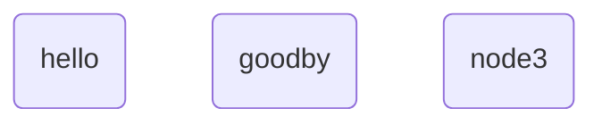

# Python

## The Guide

This guide will include the background and mechanics of the Python programming language, as well as general syntax, variables, functions, classes, arrays/lists, dictionaries and built in functions. 

The guide will then continue to explore useful built-in modules and then 3rd party modules. 

